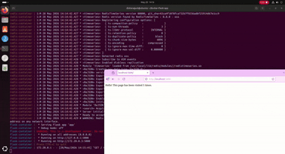
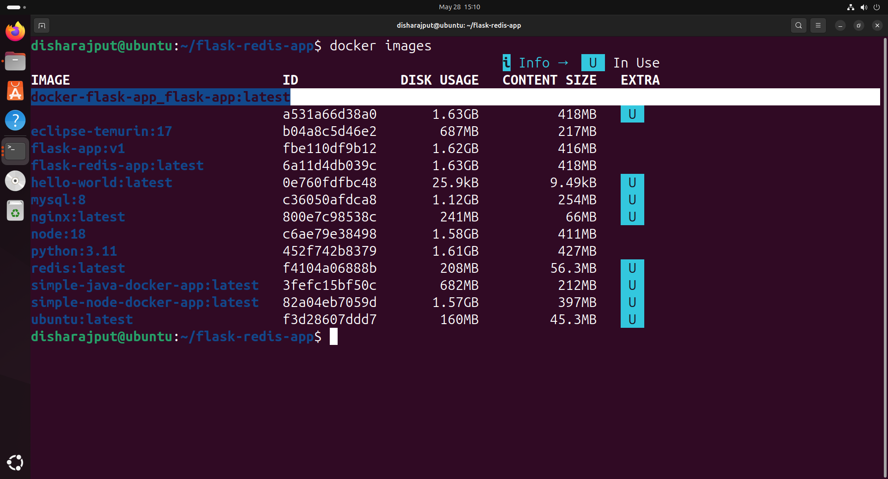
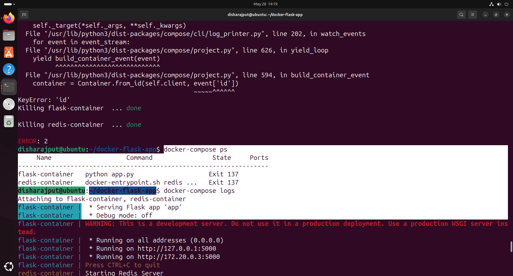

# Flask + Redis Multi-Container Application using Docker Compose


A simple multi-container application built using **Flask**, **Redis**, and **Docker Compose**.  
This project demonstrates containerized application development, service communication, Docker networking, and scalable backend architecture.
---

# 🚀 Project Overview

This application consists of:

- **Flask Web Application**
- **Redis Database**
- **Docker Compose Orchestration**

The Flask app connects to Redis and stores visit counts dynamically.

---

# 🏗️ Architecture

```text
User → Flask App → Redis
```

- Flask handles web requests
- Redis stores application data
- Docker Compose manages multi-container setup

---

# 📂 Project Structure

```text
flask-redis-app/
│
├── app.py
├── requirements.txt
├── Dockerfile
├── docker-compose.yml
└── README.md
```

---

# ⚙️ Technologies Used

- Python
- Flask
- Redis
- Docker
- Docker Compose

---

# 🐳 Docker Concepts Practiced

- Multi-container applications
- Docker networking
- Docker Compose
- Container communication
- Port mapping
- Image building
- Volume management
- Service orchestration

---

# 🔥 Features

- Containerized Flask backend
- Redis integration
- Persistent service communication
- Easy deployment using Docker Compose
- Beginner-friendly DevOps project

---

# 📦 Installation & Setup

## 1️⃣ Clone Repository

```bash
git clone https://github.com/YOUR_USERNAME/flask-redis-app.git
cd flask-redis-app
```

---

## 2️⃣ Run Application

```bash
docker-compose up --build
```

---

## 3️⃣ Access Application

Open browser:

```text
http://localhost:5000
```

---

# 🧠 Learning Outcomes

Through this project, I learned:

- How Docker containers communicate
- How Redis works with Flask
- Docker Compose fundamentals
- Managing multi-service applications
- Writing Dockerfiles
- Container orchestration basics

---

# 📸 Project Screenshot

Add your project screenshot here:

##App output


##docker image


## docker compose 

---

# 🛠️ Future Improvements

- Add Nginx reverse proxy
- Implement persistent Redis volumes
- Deploy on AWS EC2
- Add CI/CD using GitHub Actions
- Add frontend UI

---

# 👩‍💻 Author

**Disha Rajput**

---

# ⭐ Support

If you found this project useful, give it a star on GitHub ⭐
